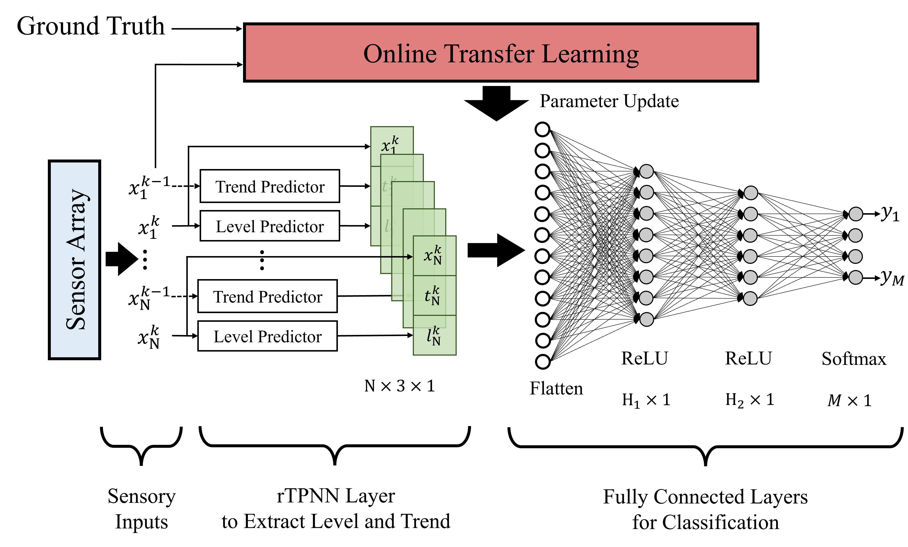

# Multi-Sensor E-Nose based on Trend Predictive Neural Network with Online Transfer Learning

This repository contains the implementation of the the e-rTPNN decision system. This model leverages the Recurrent Trend Predictive Neural Network (rTPNN) combined with online transfer learning for electronic nose (e-Nose) applications.

The detailed explanation of the architecture and comparative results on wine and COPD e-Nose datasets can be found in our published article [link](link).

## Prepare the datasets
### Wine Dataset
Download the wine dataset from https://data.mendeley.com/datasets/vpc887d53s/3 and put it under wine_dataset folder in google drive

Run the following code, which will create Wine_Dataset_All folder and file_list.npy files

### COPD Dataset
Download the COPD dataset from [https://data.mendeley.com/datasets/vpc887d53s/3](https://data.mendeley.com/datasets/h5pcn99zw4/4) and put it under COPD_dataset folder in google drive

Run the following code, which will create COPD_Dataset_All folder and file_list.npy files

## Train e-rtpnn
For online training to be performed after the offline training, Set the online_only array:

`online_only = [False, False, False, False, False]`

To perform the online training only, Set the online_only array:

`online_only = [True, True, True, True, True]`

### Train on Wine Dataset

### Train e-rtpnn on COPD Dataset

